## Table of Contents

- [Table of Contents](#table-of-contents)
- [Apa itu ExpressJS dan Drizzle ORM](#apa-itu-expressjs-dan-drizzle-orm)
- [Persiapan](#persiapan)
  - [Instalasi Node.js](#instalasi-nodejs)
  - [PostgreSQL](#postgresql)
- [Step 1: Mengkonfigurasi Project ExpressJS](#step-1-mengkonfigurasi-project-expressjs)
- [Step 2: Membuat Schema Mahasiswa dan Koneksi Database menggunakan DrizzleORM](#step-2-membuat-schema-mahasiswa-dan-koneksi-database-menggunakan-drizzleorm)
- [Step 3: Membuat Controller dan Route untuk CRUD Mahasiswa](#step-3-membuat-controller-dan-route-untuk-crud-mahasiswa)
- [Step 4: Testing API CRUD Mahasiswa](#step-4-testing-api-crud-mahasiswa)
- [Kesimpulan](#kesimpulan)

## Apa itu ExpressJS dan Drizzle ORM

ExpressJS adalah framework web minimalis untuk Node.js yang sangat populer. ExpressJS memungkinkan kita untuk membuat aplikasi web dengan mudah dan cepat. Dengan ExpressJS, kita bisa membuat API, aplikasi web, dan aplikasi mobile dengan mudah. ExpressJS memiliki banyak fitur yang memudahkan kita untuk membuat aplikasi web yang efisien dan aman.

DrizzleORM adalah ORM (Object-Relational Mapping) yang memungkinkan kita untuk berinteraksi dengan database menggunakan model-model JavaScript. Dengan DrizzleORM, kita bisa membuat model-model JavaScript yang merepresentasikan tabel-tabel di database. DrizzleORM akan mengubah model-model JavaScript tersebut menjadi query SQL yang sesuai dengan database yang kita gunakan.

Baik, tidak perlu berlama-lama lagi, mari kita mulai belajar membuat API CRUD sederhana dengan ExpressJS dan DrizzleORM. Pada tutorial ini, kita akan membuat API CRUD sederhana untuk mengelola data mahasiswa. API ini akan memiliki fitur CRUD (Create, Read, Update, Delete) untuk data mahasiswa.

## Persiapan

Sebelum memulai tutorial ini, pastikan kamu sudah melakukan persiapan berikut agar tutorial ini berjalan dengan lancar.

### Instalasi Node.js

Pertama, pastikan kamu sudah menginstall Node.js di komputer kamu. Node.js adalah runtime JavaScript yang memungkinkan kita untuk menjalankan JavaScript di sisi server. Kamu bisa menginstall Node.js dari [situs resminya](https://nodejs.org/). Cek apakah Node.js sudah terinstall dengan menjalankan perintah berikut di terminal:

```bash
node -v
```

### PostgreSQL

Kedua, pastikan kamu sudah menginstall PostgreSQL di komputer kamu. PostgreSQL adalah database open-source yang sangat powerful dan scalable. Pada kali ini, kita akan menggunakan PostgreSQL dari aplikasi Laragon. Kamu bisa menginstall Laragon dari [situs resminya](https://laragon.org/).

Jika tidak menemukan PostgreSQL pada Laragon, kamu bisa menginstallnya dengan cara berikut:

1. Buka Laragon > Menu > Tools > Quick Add > PostgreSQL.
2. Tunggu proses instalasi selesai.
3. Setelah menginstall Laragon, buka aplikasi Laragon dan klik menu PostgreSQL > Start PostgreSQL.

Setelah menginstall Laragon, buka aplikasi Laragon dan klik menu PostgreSQL > Start PostgreSQL.

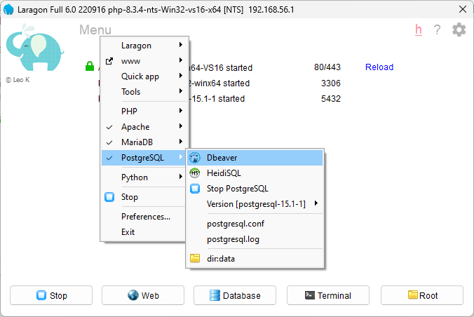

Setelah itu buka dbaver, lalu buat database baru dengan nama `express_drizzleorm`.

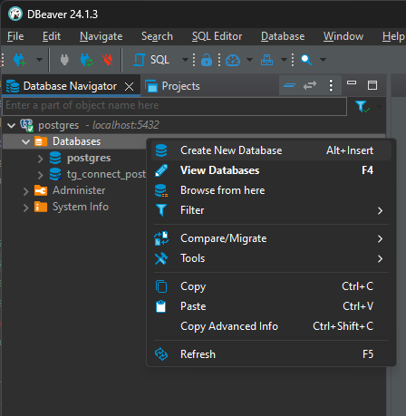

## Step 1: Mengkonfigurasi Project ExpressJS

Setelah melakukan persiapan di atas, sekarang kita akan membuat project ExpressJS dengan DrizzleORM dan menggunakan TypeScript. Berikut langkah-langkahnya:

1. Buat folder baru untuk project ExpressJS kita. Misalnya, kita buat folder dengan nama `express-drizzleorm`.

   ```bash
   mkdir express-drizzleorm
   cd express-drizzleorm
   ```

2. Inisialisasi project Node.js dengan menjalankan perintah berikut:

   ```bash
   npm init -y
   ```

3. Install ExpressJS, DrizzleORM, dan library-library lain yang dibutuhkan dengan menjalankan perintah berikut:

   ```bash
   npm install express drizzle-orm pg dotenv cors
   npm install --save-dev typescript ts-node nodemon drizzle-kit @types/node @types/express @types/cors
   ```

4. Buat file `tsconfig.json` untuk konfigurasi TypeScript:

   ```json
   {
     "compilerOptions": {
       "target": "ES2020",
       "module": "commonjs",
       "rootDir": "./src",
       "outDir": "./dist",
       "strict": true,
       "esModuleInterop": true,
       "skipLibCheck": true,
       "forceConsistentCasingInFileNames": true,
       "noImplicitAny": true,
       "strictNullChecks": true,
       "strictFunctionTypes": true,
       "skipLibCheck": true
     }
   }
   ```

5. Buat file `.env` untuk konfigurasi environment:

   ```env
    # SERVER PORT
    PORT = 3000

    # CORS
    CORS_ORIGIN = *

    # DATABASE
    DB_HOST = 127.0.0.1
    DB_POST = 5432
    DB_USER = postgres
    DB_PASSWORD =
    DB_DATABASE = postgres
   ```

6. Buat folder `src` dan file `index.ts` di dalam folder `src`:

   ```bash
    mkdir src
    touch src/index.ts
   ```

   Pada file `index.ts`, tambahkan kode berikut untuk menginisialisasi ExpressJS:

   ```typescript
   import * as dotenv from "dotenv";
   import express from "express";
   import cors from "cors";

   dotenv.config();

   const app = express();

   app.use(
     cors({
       origin: "*",
     })
   );
   app.use(express.json());

   app.get("/", (req, res) => {
     res.send("Hello World!");
   });

   app.listen(process.env.PORT, () => {
     console.log(`Server is running on port ${process.env.PORT}`);
   });
   ```

   Tambahkan script dev pada `package.json`:

   ```json
    "scripts": {
      "dev": "nodemon ./src/index.ts"
    }
   ```

   Lalu, jalankan perintah berikut untuk menjalankan server ExpressJS:

   ```bash
    npm run dev
   ```

   Buka browser dan akses `http://localhost:3000`. Jika berhasil, maka kamu akan melihat pesan `Hello World!`.

   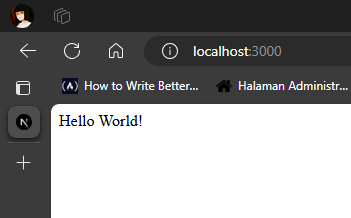

## Step 2: Membuat Schema Mahasiswa dan Koneksi Database menggunakan DrizzleORM

Setelah berhasil membuat project ExpressJS, sekarang kita akan membuat schema. Apa itu schema? Schema adalah representasi struktur tabel di database, schema sendiri dapat disebut juga sebagai model. Pada bagian ini, kita akan membuat schema untuk tabel `mahasiswas`. Berikut langkah-langkahnya:

1.  Buat folder `schema` di dalam folder `db`:

    ```bash
     mkdir src/db/schema
    ```

2.  Buat file `mahasiswa.ts` di dalam folder `schema`:

    ```bash
     touch src/db/schema/mahasiswa.ts
    ```

    Pada file `mahasiswa.ts`, tambahkan kode berikut untuk membuat schema mahasiswa:

    ```typescript
    import { serial, pgTable, varchar, integer } from "drizzle-orm/pg-core";

    export const mahasiswaSchema = pgTable("mahasiswas", {
      id: serial("id").primaryKey(),
      nama: varchar("nama").notNull(),
      nim: varchar("nim").notNull(),
      jurusan: varchar("jurusan").notNull(),
      angkatan: integer("angkatan").notNull(),

      createdAt: varchar("created_at").notNull().defaultNow(),
      updatedAt: varchar("updated_at").notNull().defaultNow(),
    });
    ```

    - `serial()` : Menandakan bahwa kolom tersebut adalah primary key dan auto increment.
    - `varchar()` : Menandakan bahwa kolom tersebut adalah varchar.
    - `integer()` : Menandakan bahwa kolom tersebut adalah integer.
    - `notNull()` : Menandakan bahwa kolom tersebut tidak boleh kosong atau null.
    - `defaultNow()` : Menandakan bahwa kolom tersebut akan diisi dengan waktu saat ini atau disebut juga dengan timestamp.

3.  Buat file `connection.ts` di dalam folder `db`:

    ```bash
     touch src/db/connection.ts
    ```

    Pada file `connection.ts`, tambahkan kode berikut untuk membuat koneksi ke database:

    ```typescript
    import * as dotenv from "dotenv";
    import { drizzle } from "drizzle-orm/node-postgres";
    import { Client } from "pg";

    dotenv.config();

    const client = new Client({
      host: process.env.DB_HOST,
      port: process.env.DB_PORT ? parseInt(process.env.DB_PORT) : 5432,
      user: process.env.DB_USER,
      password: process.env.DB_PASSWORD,
      database: process.env.DB_DATABASE,
    });

    client
      .connect()
      .then(() => {
        console.log("Connected to database");
      })
      .catch((err) => {
        console.error(err);
      });

    const db = drizzle(client);

    export default db;
    ```

    `connection.ts` berfungsi untuk membuat koneksi ke database PostgreSQL. Pada kode di atas, kita menggunakan `dotenv` untuk mengambil konfigurasi database dari file `.env`. Selanjutnya, kita membuat koneksi ke database PostgreSQL menggunakan `pg` dan `drizzle-orm`.

4.  Buat file `drizzle.config.ts` di dalam folder `src`:

    ```bash
     touch src/drizzle.config.ts
    ```

    Pada file `drizzle.config.ts`, tambahkan kode berikut untuk mengatur konfigurasi DrizzleORM:

    ```typescript
    import * as dotenv from "dotenv";
    import { defineConfig } from "drizzle-kit";

    dotenv.config();

    interface CustomConfig {
      schema: string;
      out: string;
      dialect: "postgresql" | "mysql" | "sqlite";
      connection?: {
        host?: string;
        port?: number;
        user?: string;
        password?: string;
        database?: string;
      };
    }

    export default defineConfig({
      dialect: "postgresql", // 'postgresql' | 'mysql' | 'sqlite'
      schema: "./src/db/schema",
      out: "./src/drizzle/migrations",
      dbCredentials: {
        host: process.env.DB_HOST,
        port: process.env.DB_PORT,
        user: process.env.DB_USER,
        password: process.env.DB_PASSWORD,
        database: process.env.DB_DATABASE,
      },
    } as CustomConfig);
    ```

    File `drizzle.config.ts` berfungsi untuk mengatur konfigurasi DrizzleORM. Pada kode di atas, kita menggunakan `dotenv` untuk mengambil konfigurasi database dari file `.env`. Selanjutnya, kita mendefinisikan konfigurasi DrizzleORM dengan `defineConfig`. Pada konfigurasi tersebut, kita mengatur `dialect`, `schema`, `out`, dan `dbCredentials`.

    Pada konfigurasi di atas, kita menggunakan `dialect: "postgresql"` karena kita akan menggunakan database PostgreSQL. Selain itu, kita juga mengatur `schema` dengan path ke folder schema yang nantinya akan membaca schema dari folder tersebut. Selanjutnya, kita mengatur `out` dengan path ke folder migrations yang nantinya akan membuat file migration di folder tersebut. Terakhir, kita mengatur `dbCredentials` dengan konfigurasi database yang diambil dari file `.env`.

5.  Buat file `migrate.ts` di dalam folder `db`:

    ```bash
     touch src/db/migrate.ts
    ```

    Pada file `migrate.ts`, tambahkan kode berikut untuk menjalankan migrasi DrizzleORM:

    ```typescript
    import { migrate } from "drizzle-orm/postgres-js/migrator";
    import db from "./connection";

    async function migrateData() {
      await migrate(db, { migrationsFolder: "./src/drizzle/migrations" });
      process.exit(0);
    }

    migrateData().catch((err) => {
      console.error(err);
      process.exit(1);
    });
    ```

    File `migrate.ts` berfungsi untuk menjalankan migrasi DrizzleORM. Pada kode di atas, kita menggunakan `migrate` dari `drizzle-orm/postgres-js/migrator` untuk menjalankan migrasi. Selanjutnya, kita membuat fungsi `migrateData` yang menjalankan migrasi dengan memigrate ke folder migrations yang ada di `src/drizzle/migrations`. Terakhir, kita menjalankan fungsi `migrationData` dan menangkap error jika terjadi error.

6.  Tambahkan command `migration:generate` pada `package.json`:

    ```json
    "scripts": {
      "migration:generate": "drizzle-kit generate --config=./src/drizzle.config.ts"
    }
    ```

    Jalankan perintah berikut untuk membuat file migration:

    ```bash
    npm run migration:generate
    ```

    Jika berhasil, maka kamu akan melihat file migration di folder `src/drizzle/migrations`.

    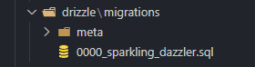

7.  Tambahkan command `migrateion:push` pada `package.json`:

    ```json
    "scripts": {
      "migration:push": "node -r ts-node/register ./src/db/migrate.ts"
    }
    ```

    Dikarenakan kita tidak menggunakan SSL connection, maka menggunakan command di atas untuk menjalankan migrasi.

    Jalankan perintah berikut untuk menjalankan migrasi:

    ```bash
    npm run migration:push
    ```

    Jika berhasil, maka kamu akan melihat pesan `Connected to database`.

    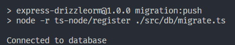

    Maka, schema `mahasiswas` akan terbuat di database `express_drizzleorm`. Jika kamu ingin melihat schema yang sudah dibuat, kamu bisa menggunakan aplikasi DBAver.

    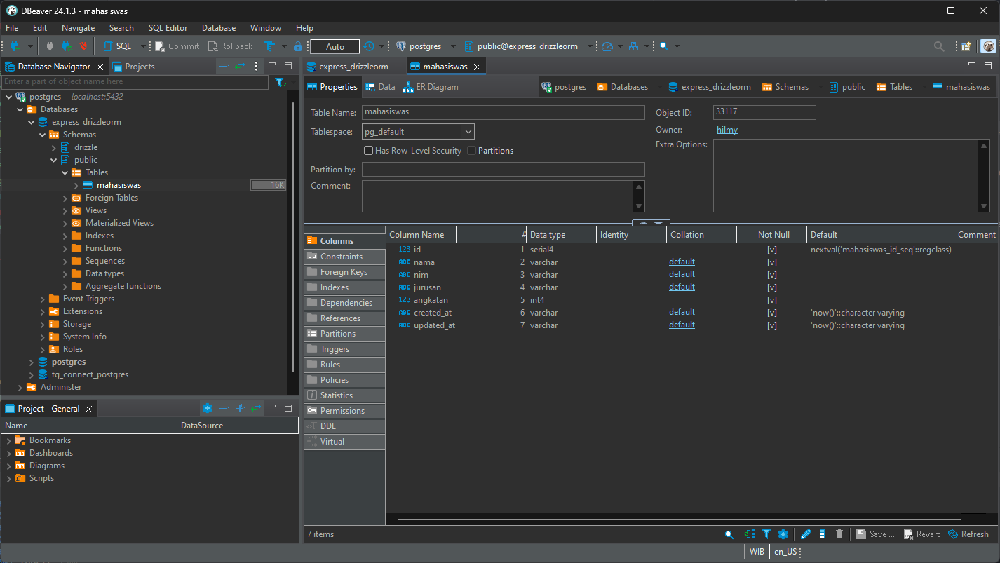

    Dengan column `id`, `nama`, `nim`, `jurusan`, `angkatan`, `created_at`, dan `updated_at`. Sama seperti yang sudah kita definisikan pada schema `mahasiswa`.

    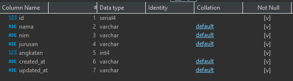

## Step 3: Membuat Controller dan Route untuk CRUD Mahasiswa

Setelah berhasil membuat schema dan koneksi ke database, sekarang kita akan membuat controller dan route untuk CRUD mahasiswa. Controller sendiri berfungsi untuk mengatur logika bisnis dari aplikasi kita. Pada bagian ini, kita akan membuat controller dan route untuk CRUD mahasiswa. Berikut langkah-langkahnya:

1.  Buat folder `controllers` dan `routes` di dalam folder `src`:

    ```bash
     mkdir src/controllers && src/routes
    ```

2.  Buat file `mahasiswa.controller.ts` di dalam folder `controllers`:

    ```bash
     touch src/controllers/mahasiswa.controller.ts
    ```

    Pada file `mahasiswa.controller.ts`, tambahkan kode berikut untuk membuat controller CRUD mahasiswa:

    Pada bagian header, kita mengimport `dotenv`, `Request`, `Response`, `mahasiswaSchema`, `db`, `eq`, `sql` dan `dotenv.config`.

    ```typescript
    import dotenv from "dotenv";
    import { Request, Response } from "express";

    // schema imports
    import { mahasiswaSchema } from "../db/schema/mahasiswa";
    import db from "../db/connection";
    import { eq, sql } from "drizzle-orm";

    dotenv.config();
    ```

    Pada bagian `getAllMahasiswa`, kita membuat fungsi untuk mengambil semua data mahasiswa dari database.

    ```typescript
    // getMahasiswa allows you to get all mahasiswa data
    export const getMahasiswa = async (req: Request, res: Response) => {
      try {
        const mahasiswas = await db.select().from(mahasiswaSchema).execute();
        return res.status(200).json({
          status: "success",
          data: mahasiswas,
        });
      } catch (error: any) {
        return res.status(500).json({
          status: "error",
          message: error.message,
        });
      }
    };
    ```

    Pada bagian `getMahasiswaById`, kita membuat fungsi untuk mengambil data mahasiswa berdasarkan id dari request parameter.

    ```typescript
    // getMahasiswaById allows you to get mahasiswa data by id
    export const getMahasiswaById = async (req: Request, res: Response) => {
      try {
        const { id } = req.params;
        const mahasiswa = await db
          .select()
          .from(mahasiswaSchema)
          .where(eq(mahasiswaSchema.id, parseInt(id)))
          .execute();

        // check if id did not exist
        if (mahasiswa.length === 0) {
          return res.status(404).json({
            status: "error",
            message: "Mahasiswa not found",
          });
        }

        return res.status(200).json({
          status: "success",
          data: mahasiswa,
        });
      } catch (error: any) {
        return res.status(500).json({
          status: "error",
          message: error.message,
        });
      }
    };
    ```

    Pada bagian `createMahasiswa`, kita membuat fungsi untuk menambahkan data mahasiswa ke database.

    ```typescript
    // createMahasiswa allows you to create new mahasiswa
    export const createMahasiswa = async (req: Request, res: Response) => {
      try {
        const { nama, nim, jurusan, angkatan } = req.body;
        await db
          .insert(mahasiswaSchema)
          .values({
            nama,
            nim,
            jurusan,
            angkatan,
          })
          .execute();

        return res.status(201).json({
          status: "success",
          message: "Mahasiswa created",
          data: {
            nama,
            nim,
            jurusan,
            angkatan,
          },
        });
      } catch (error: any) {
        return res.status(500).json({
          status: "error",
          message: error.message,
        });
      }
    };
    ```

    Pada bagian `updateMahasiswa`, kita membuat fungsi untuk mengupdate data mahasiswa berdasarkan id dari request parameter.

    ```typescript
    // updateMahasiswa allows you to update mahasiswa data
    export const updateMahasiswa = async (req: Request, res: Response) => {
      try {
        const { id } = req.params;
        const { nama, nim, jurusan, angkatan } = req.body;
        await db
          .update(mahasiswaSchema)
          .set({
            nama,
            nim,
            jurusan,
            angkatan,

            // update updated_at field
            updated_at: sql`now()`,
          })
          .where(eq(mahasiswaSchema.id, parseInt(id)))
          .execute();

        return res.status(200).json({
          status: "success",
          message: "Mahasiswa updated successfully",
          data: {
            nama,
            nim,
            jurusan,
            angkatan,
          },
        });
      } catch (error: any) {
        return res.status(500).json({
          status: "error",
          message: error.message,
        });
      }
    };
    ```

    Pada bagian `deleteMahasiswa`, kita membuat fungsi untuk menghapus data mahasiswa berdasarkan id dari request parameter.

    ```typescript
    // deleteMahasiswa allows you to delete mahasiswa data
    export const deleteMahasiswa = async (req: Request, res: Response) => {
      try {
        const { id } = req.params;
        await db
          .delete(mahasiswaSchema)
          .where(eq(mahasiswaSchema.id, parseInt(id)))
          .execute();

        return res.status(200).json({
          status: "success",
          message: "Mahasiswa deleted successfully",
        });
      } catch (error: any) {
        return res.status(500).json({
          status: "error",
          message: error.message,
        });
      }
    };
    ```

3.  Buat file `mahasiswa.route.ts` di dalam folder `routes`:

    ```bash
     touch src/routes/mahasiswa.route.ts
    ```

    Pada file `mahasiswa.route.ts`, tambahkan kode berikut untuk membuat route CRUD mahasiswa:

    Pada bagian header, kita mengimport `Router`, `getMahasiswa`, `getMahasiswaById`, `createMahasiswa`, `updateMahasiswa`, dan `deleteMahasiswa` dari file `mahasiswa.controller`.

    ```typescript
    import { Router } from "express";
    import {
      getMahasiswa,
      getMahasiswaById,
      createMahasiswa,
      updateMahasiswa,
      deleteMahasiswa,
    } from "../controllers/mahasiswa.controller";
    ```

    Pada bagian selanjutnya, kita membuat route untuk CRUD mahasiswa dengan menggunakan `Router()` dari ExpressJS.

    Fungsi `get` digunakan untuk mengambil data, `post` digunakan untuk menambahkan data, `put` digunakan untuk mengupdate data, dan `delete` digunakan untuk menghapus data.

    ```typescript
    const router = Router();

    router.get("/mahasiswas", getMahasiswa);
    router.get("/mahasiswa/:id", getMahasiswaById);
    router.post("/mahasiswa", createMahasiswa);
    router.put("/mahasiswa/:id", updateMahasiswa);
    router.delete("/mahasiswa/:id", deleteMahasiswa);

    export default router;
    ```

4.  Tambahkan route import pada file `index.ts`:

    ```typescript
    import mahasiswaRoute from "./routes/mahasiswa.route";
    ```

    Tambahkan route pada file `index.ts`:

    ```typescript
    app.use("/api", mahasiswaRoute);
    ```

    Lalu, jalankan perintah berikut untuk menjalankan server ExpressJS:

    ```bash
    npm run dev
    ```

## Step 4: Testing API CRUD Mahasiswa

Pada tahap ini, kita akan mencoba menguji API CRUD mahasiswa yang sudah kita buat. Jika anda menggunakan vscode, anda bisa menggunakan ekstensi `REST Client` untuk menguji API yang sudah kita buat.

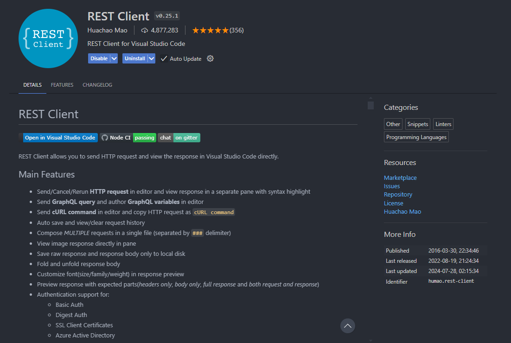

Dengan membuat file `request.rest` di dalam folder `src`:

Berikut adalah contoh penggunaan REST Client untuk menguji API CRUD mahasiswa:

1.  Mengambil semua data mahasiswa:

    ```http
    GET http://localhost:3000/api/mahasiswas
    ```

    Jika berhasil, maka akan menampilkan data mahasiswa yang sudah ditambahkan.

    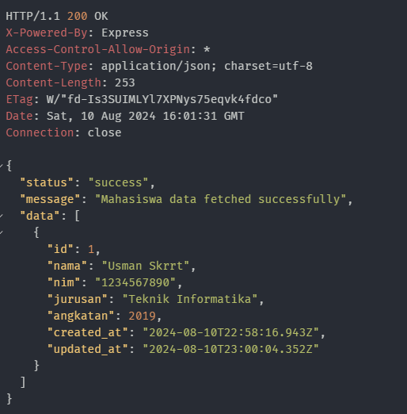

2.  Mengambil data mahasiswa berdasarkan id:

    ```http
    GET http://localhost:3000/api/mahasiswa/1
    ```

    Jika berhasil, maka akan menampilkan data mahasiswa berdasarkan id yang sudah ditambahkan.

    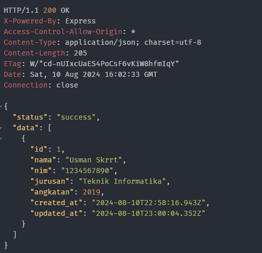

3.  Menambahkan data mahasiswa:

    ```http
    POST http://localhost:3000/api/mahasiswa
    Content-Type: application/json

    {
      "nama": "Usman",
      "nim": "1234567890",
      "jurusan": "Teknik Informatika",
      "angkatan": 2019
    }
    ```

    Jika berhasil, maka kamu akan mendapatkan pesan `Mahasiswa created successfully` dan data mahasiswa yang sudah ditambahkan.

    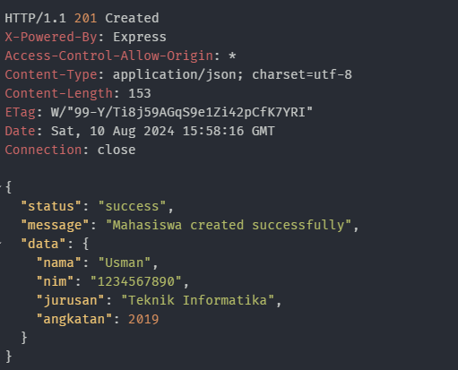

4.  Mengupdate data mahasiswa berdasarkan id:

    ```http
    PUT http://localhost:3000/api/mahasiswa/1
    Content-Type: application/json

    {
      "nama": "Usman Skrrt"
    }
    ```

    Jika berhasil, maka kamu akan mendapatkan pesan `Mahasiswa updated successfully` dan data mahasiswa yang sudah diupdate.

    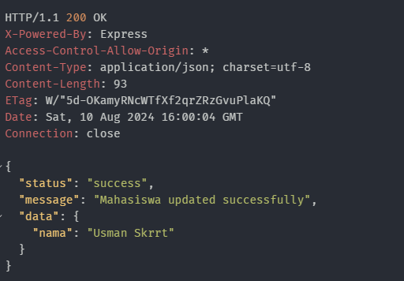

5.  Menghapus data mahasiswa berdasarkan id:

    ```http
    DELETE http://localhost:3000/api/mahasiswa/1
    ```

    Jika berhasil, maka kamu akan mendapatkan pesan `Mahasiswa deleted successfully`.

## Kesimpulan

Dengan demikian, kita sudah berhasil membuat API CRUD sederhana dengan ExpressJS dan DrizzleORM. Pada tutorial ini, kita sudah belajar bagaimana cara membuat schema, koneksi ke database, controller, dan route untuk CRUD mahasiswa. Selain itu, kita juga sudah mencoba menguji API CRUD mahasiswa dengan menggunakan REST Client. Jika kamu tidak ingin menggunakan REST Client, kamu bisa menggunakan Postman atau aplikasi sejenisnya.

Anda dapat lebih memahami tentang ExpressJS dan DrizzleORM, kamu bisa membaca dokumentasi resminya di [ExpressJS](https://expressjs.com/) dan [DrizzleORM Postgresql](https://orm.drizzle.team/docs/get-started-postgresql).

Untuk melihat kode lengkapnya, kamu bisa melihatnya di [Repository GitHub](https://github.com/hilmyha/blog-post-tutorials/tree/master/express-drizzleorm).

Selamat mencoba! Semoga tutorial ini bermanfaat dan membantu kamu dalam belajar membuat API CRUD sederhana dengan ExpressJS dan DrizzleORM. Terima kasih!

```json
{
  "status": "success",
  "message": "Belajar Basic CRUD dengan ExpressJS dan DrizzleORM"
}
```
