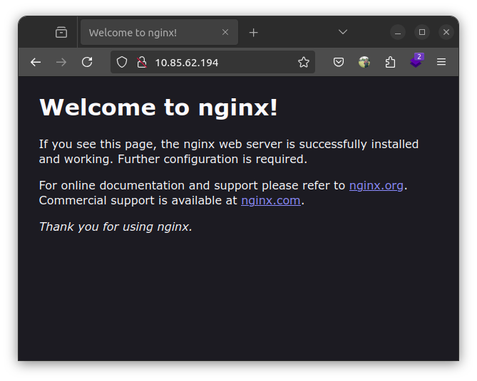

Lama sekali tidak menulis artikel di blog ini. Kali ini saya akan berbagi tentang cara setup Nginx server untuk deploy aplikasi Laravel. Nginx adalah web server yang populer digunakan untuk menghosting website. Let's get started!

## Table of Contents

- [Table of Contents](#table-of-contents)
- [Apa sih Nginx?](#apa-sih-nginx)
- [Setup Ubuntu Server](#setup-ubuntu-server)
  - [Update package list dan upgrade package yang ada di server](#update-package-list-dan-upgrade-package-yang-ada-di-server)
  - [Install Nginx](#install-nginx)
  - [Selanjutnya kita menginstall PHP dan MySQL atau MariaDB](#selanjutnya-kita-menginstall-php-dan-mysql-atau-mariadb)
  - [Install Git](#install-git)
  - [Test Nginx di browser](#test-nginx-di-browser)
- [Setup untuk deploy aplikasi Laravel](#setup-untuk-deploy-aplikasi-laravel)
  - [Install Composer](#install-composer)
  - [Clone repository Laravel](#clone-repository-laravel)
  - [Setting Laravel](#setting-laravel)
  - [Buat database di MariaDB atau MySQL](#buat-database-di-mariadb-atau-mysql)
- [Konfigurasi Nginx host agar Laravel bisa diakses di browser](#konfigurasi-nginx-host-agar-laravel-bisa-diakses-di-browser)
- [Kesimpulan](#kesimpulan)
- [Referensi](#referensi)

## Apa sih Nginx?

Nginx atau yang biasa disebut Engine-X adalah sebuah web server yang populer digunakan untuk menghosting website. Nginx memiliki performa yang sangat baik dan stabil, sehingga banyak perusahaan besar yang menggunakan Nginx untuk menghosting website mereka.

Nginx pertama kali dirilis pada tahun 2004 oleh Igor Sysoev. Nginx dikembangkan dengan tujuan untuk mengatasi masalah performa dan skalabilitas yang dimiliki oleh web server Apache. Nginx menggunakan arsitektur event-driven yang memungkinkan Nginx untuk menangani banyak koneksi secara efisien. Bersumber dari https://www.nginx.com/

## Setup Ubuntu Server

Pada kesempatan kali ini saya menggunakan Ubuntu versi 24.04.1 LTS kalian dapat menggunakan VPS di cloud tetapi saya menggunakan virtualisasi container dengan LXD (Linux Container) yang berjalan diatas Ubuntu juga, bagi kalian yang menggunakan Ubuntu, untuk tutorial menggunakan LXC atau LXD anda dapat melihat dokumentasinya di [Ubuntu LXD](https://linuxcontainers.org/lxd/). Tetapi bagi kalian yang menggunakan Windows, bisa menggunakan WSL2 atau virtualisasi VirtualBox, untuk tutorial menggunakan VirtualBox bisa dilihat di [Ubuntu VirtualBox](https://ubuntu.com/tutorials/install-ubuntu-desktop#1-overview) atau [WSL2](https://docs.microsoft.com/en-us/windows/wsl/install). Oke langsung saja kita mulai.

### Update package list dan upgrade package yang ada di server

Pertama-tama, kita perlu memperbarui daftar package list dan mengupgrade package yang ada di server.

```bash
sudo apt update && sudo apt upgrade
```

command apt update digunakan untuk mengupdate daftar package list yang ada di server dengan repository atau mirror yang terbaru. Sedangkan command apt upgrade digunakan untuk mengupgrade package yang sudah terdafar pada operating system atau server.

### Install Nginx

Setelah package list dan package sudah diupdate, selanjutnya kita akan menginstall Nginx.

```bash
sudo apt install nginx
```

Setelah proses instalasi selesai, kita bisa mengecek status Nginx dengan menjalankan perintah berikut:

```bash
sudo systemctl status nginx
```

yang nanti akan muncul output status Nginx seperti berikut:


Jika status Nginx sudah active (running), berarti Nginx sudah berhasil diinstall dan berjalan dengan baik.

### Selanjutnya kita menginstall PHP dan MySQL atau MariaDB

Langkah pertama kita akan menginstall PHP dan beberapa ekstensi yang dibutuhkan oleh Laravel kita.

```bash
sudo apt install php php-fpm php-mysql php-mbstring php-xml php-zip php-curl
```

Disini kita menginstall :

- PHP-FPM (FastCGI Process Manager) yang akan digunakan untuk menjalankan PHP script
- PHP-MySQL untuk menghubungkan PHP dengan database MySQL atau MariaDB
- PHP-Mbstring untuk menghandle string, PHP-XML untuk menghandle XML
- PHP-Zip untuk menghandle file zip
- PHP-Curl untuk menghandle HTTP request.

Disini kita mendapat masalah ketika menginstall PHP, karena library Apache2 yang terinstall di server. Kita perlu menghapus Apache2 terlebih dahulu

```bash
sudo apt remove apache2
```

Langkah selanjutnya kita akan menginstall MySQL atau MariaDB. Disini saya menggunakan MariaDB, karena MariaDB adalah fork dari MySQL yang lebih cepat dan lebih stabil. Kalian dapat menjalankan perintah berikut.

```bash
sudo apt install mariadb-server
```

Setelah proses instalasi PHP dan MariaDB selesai, kita akan cek apakah PHP dan MariaDB sudah terinstall dengan benar.

```bash
php -v
```

Versi dari PHP akan muncul seperti ini


Dan untuk MariaDB atau MySQL kita jalankan perintah ini

```bash
mysql -V
```

Untuk melihat versi dari MariaDB atau MySQL yang terinstall.


### Install Git

Lalu kita install git untuk mengelola source code aplikasi kita.

```bash
sudo apt install git
```

### Test Nginx di browser

Kita sudah berhasil menginstall Nginx, PHP dan MariaDB atau MySQL di server kita. Sekarang kita akan mencoba untuk mengetest apakah Nginx juga sudah berjalan dengan baik dengan cara mengakses IP address server kita di browser.

Jika kalian bingung untuk mencari IP address server kalian, kalian dapat menjalankan perintah ini

```bash
ip a
```

Tetapi saya merekomendasikan untuk menggunakan net-tools, kalian dapat menginstall net-tools dikarenakan lebih mudah dalam melihat IP address server kalian.

```bash
sudo apt install net-tools
```

Lalu setelah itu jalankan dan akan menampilkan IP address server kalian seperti digambar bawah ini

```bash
ifconfig
```


Setelah itu kalian dapat mengakses IP address server kalian di browser, jika muncul halaman seperti ini berarti Nginx sudah berjalan dengan baik di server kalian.



## Setup untuk deploy aplikasi Laravel

Setelah kita berhasil menginstall Nginx, PHP dan MariaDB atau MySQL di server kita, selanjutnya kita akan setting Laravel di server kita. Kita akan menggunakan git untuk mengclone source code Laravel kita.

```bash
git clone <url-repository-laravel>
```

disini kita menggunakan repository Laravel yang sudah ada, kalian bisa menggunakan repository Laravel kalian sendiri atau menggunakan repository Laravel yang sudah saya sediakan di [Github](https://github.com/hilmyha/simple-api-mahasiswa).

### Install Composer

Setelah kita mengclone source code Laravel kita, selanjutnya kita akan menginstall Composer. Composer adalah dependency manager untuk PHP yang digunakan untuk mengelola dependency PHP pada project Laravel.

```bash
sudo apt install composer
```

Jika kalian melihat error `Do not run Composer as root/super user!` ketika kita menjalankan perintah `composer`, tidak apa karena kita login sebagai root.

Tetapi kalian juga bisa mengatasi error tersebut dengan membuat user baru pada ubuntu server kalian dapat melihat tutorialnya di [Ubuntu Add User](https://linuxize.com/post/how-to-create-a-sudo-user-on-ubuntu/).

Setelah proses instalasi Composer selesai, kita akan cek apakah Composer sudah terinstall dengan benar.

```bash
composer -v
```


Jika muncul versi dari Composer seperti diatas, berarti Composer sudah terinstall dengan benar.

### Clone repository Laravel

Setelah kita menginstall Composer, selanjutnya kita akan mengambil source code Laravel kita dengan menggunakan git.

Perlu kita ketahui bahwa kita harus berada di dalam folder `/var/www/` untuk mengclone repository Laravel kita. Kita bisa menggunakan perintah berikut untuk berpindah ke folder `/var/www/`.

```bash
cd /var/www/
```

Setelah kita berada di dalam folder `/var/www/`, kita bisa mengclone repository Laravel kita seperti di step [Setting Laravel](#setting-laravel)

Lalu masuk ke directory Laravel kita

```bash
cd <nama-folder-laravel>
```

### Setting Laravel

Disini saya menggunakan directory `simple-api-mahasiswa` yang sudah saya sediakan di [Github](https://github.com/hilmyha/simple-api-mahasiswa) untuk contoh dan belajar kalian.

Setelah kita masuk ke directory Laravel kita, kita akan menginstall dependency PHP yang dibutuhkan oleh Laravel kita.

```bash
composer install
```

Karena contoh ini sebuah API, kita tidak perlu menginstall frontend seperti Vue.js atau React.js. Kita hanya perlu menginstall dependency PHP yang dibutuhkan oleh Laravel kita.

Tetai jika kalian ingin menginstall frontend seperti Vue.js atau React.js, kalian bisa menginstall Node.js terlebih dahulu, atau jika kalian ingin menggunakan nvm (Node Version Manager) kalian dapat melihat tutorialnya di [Node Version Manager](https://github.com/nvm-sh/nvm?tab=readme-ov-file#installing-and-updating)

Cara ini lebih mudah dan efisien karena kita tidak perlu menginstall Node.js secara global di server kita, langsung saja menggunakan

```bash
nvm install <versi-nodejs>
```

Jika ingin menggunakan Node.js versi LTS (Long Term Support) kalian dapat menggunakan tag `--lts` dibelakang command `nvm install`.

Lanjut kita membuat file `.env` di directory Laravel kita bisa menggunakan `nano` atau `vim` untuk membuat file `.env`. Tetapi di Laravel sudah ada file `.env.example` yang bisa kita copy dan rename menjadi `.env`.

```bash
cp .env.example .env
```

Setelah kita membuat file `.env`, kita akan menggenerate key baru untuk aplikasi Laravel kita.

```bash
php artisan key:generate
```

### Buat database di MariaDB atau MySQL

Setelah kita menginstall Composer dan mengclone repository Laravel kita, selanjutnya kita akan membuat database di MariaDB atau MySQL.

```bash
mysql -u root -p
```

Lalu masuk ke MariaDB atau MySQL, kita akan membuat database baru dengan nama `simple_api_mahasiswa`.

```sql
CREATE DATABASE simple_api_mahasiswa;
```

Kita akan membuat user baru dengan nama `user_api` dan password `password_api` yang memiliki akses ke database `simple_api_mahasiswa`.

```sql
CREATE USER 'user_api'@'localhost' IDENTIFIED BY 'password_api';
```

Berikan akses user `user_api` ke database `simple_api_mahasiswa`.

```sql
GRANT ALL PRIVILEGES ON simple_api_mahasiswa.* TO 'user_api'@'localhost';
```

Setelah kita memberikan akses user `user_api` ke database `simple_api_mahasiswa`, kita akan mengupdate perubahan yang kita buat.

```sql
FLUSH PRIVILEGES;
```

Lalu

```sql
exit;
```

Discleimer: Jangan lupa untuk mengganti `user_api` dan `password_api` dengan username dan password yang kalian inginkan. Disini saya menggunakan `user_api` dan `password_api` **hanya sebagai contoh**.

Edit file `.env` yang sudah kita buat tadi, kita akan mengkonfigurasi database kita di file `.env`.

```php
DB_CONNECTION=mariadb
DB_HOST=127.0.0.1
DB_PORT=3306
DB_DATABASE=simple_api_mahasiswa
DB_USERNAME=user_api
DB_PASSWORD=password_api
```

Setelah kita mengkonfigurasi database kita di file `.env`, kita akan menjalankan migration dan seeder yang sudah kita buat di Laravel kita. Jika kalian tidak ada migration dan seeder, kalian bisa langsung saja menjalankan perintah `php artisan migrate`.

```bash
php artisan migrate --seed
```


## Konfigurasi Nginx host agar Laravel bisa diakses di browser

Setelah kita berhasil menginstall Laravel dan mengkonfigurasi database kita, selanjutnya kita akan mengkonfigurasi Nginx host agar Laravel kita bisa diakses di browser.

Kita akan membuat file konfigurasi baru di `/etc/nginx/sites-available/` dengan nama `simple-api-mahasiswa`.

```bash
nano /etc/nginx/sites-available/www.simpleapi.com
```

Mengapa saya menggunakan `www.simpleapi.com`? Karena saya menggunakan domain `www.simpleapi.com` sebagai domain untuk Laravel saya. Kalian bisa menggunakan domain yang kalian inginkan nantinya, disini saya menggunakan domain tersebut hanya sebagai contoh

Lalu selanjutnya isi konfigurasi tersebut dengan konfigurasi Nginx yang ada pada dokumentasi Laravel [Nginx Configuration](https://laravel.com/docs/11.x/deployment#nginx)

```nginx
server {
    listen 80;
    listen [::]:80;
    server_name www.simpleapi.com;
    root /var/www/simple-api-mahasiswa/public;

    add_header X-Frame-Options "SAMEORIGIN";
    add_header X-Content-Type-Options "nosniff";

    index index.php;

    charset utf-8;

    location / {
        try_files $uri $uri/ /index.php?$query_string;
    }

    location = /favicon.ico { access_log off; log_not_found off; }
    location = /robots.txt  { access_log off; log_not_found off; }

    error_page 404 /index.php;

    location ~ ^/index\.php(/|$) {
        fastcgi_pass unix:/var/run/php/php8.3-fpm.sock;
        fastcgi_param SCRIPT_FILENAME $realpath_root$fastcgi_script_name;
        include fastcgi_params;
        fastcgi_hide_header X-Powered-By;
    }

    location ~ /\.(?!well-known).* {
        deny all;
    }
}
```

Perlu diingat bahwa kita harus mengganti server_name dengan domain yang kita inginkan, root dengan directory public Laravel kita, dan fastcgi_pass dengan versi PHP yang kita gunakan.

Untuk melihat versi PHP yang kita gunakan, kita dapat melihat di [PHP](#selanjutnya-kita-menginstall-php-dan-mysql-atau-mariadb) disini saya menggunakan PHP versi 8.3 dan otomatis versi PHP-FPM yang saya gunakan adalah `php8.3-fpm.sock`.

Setelah kita membuat file konfigurasi Nginx baru, kita akan membuat symlink dari file konfigurasi Nginx yang kita buat tadi ke `/etc/nginx/sites-enabled/`.

```bash
sudo ln -s /etc/nginx/sites-available/www.simpleapi.com /etc/nginx/sites-enabled/
```

Untuk mengakses apa yang telah kita lakukan kalian dapat mengatur hosts di komputer kalian, kalian dapat mengakses file hosts di Windows di `C:\Windows\System32\drivers\etc\hosts` dan di Linux di `/etc/hosts`.

```bash
sudo nano /etc/hosts
```

Lalu tambahkan IP address server kalian dan domain yang kalian gunakan.


Setelah itu kita restart Nginx

```bash
sudo systemctl restart nginx
```

Voila! Laravel kita sudah bisa diakses di browser dengan domain yang kita gunakan. Eits, tetapi masih ada yang salah, kita belum memberikan permission pada folder Laravel kita.

Kalian dapat memberikan permission pada folder Laravel kalian dengan perintah berikut dengan tujuan agar Nginx dapat membaca file dan folder Laravel kalian.

```bash
sudo chown -R www-data:www-data /var/www/simple-api-mahasiswa
```

Yes, lalu restart browser kalian dan akses domain yang kalian gunakan, jika muncul halaman seperti ini berarti Laravel kalian sudah berhasil dihosting di server kalian.


Sekian artikel kali ini, semoga bermanfaat dan selamat mencoba!

## Kesimpulan

Pada artikel ini kita telah belajar cara setup Nginx server untuk deploy aplikasi Laravel di server Linux. Kita juga belajar cara menginstall PHP, MariaDB atau MySQL, dan Composer di server kita. Selain itu, kita juga belajar cara mengkonfigurasi Nginx host agar Laravel kita bisa diakses di browser.

Jika menggunakan VPS dan sudah menggunakan domain yang valid, kalian tidak perlu mengatur hosts di komputer kalian. Kalian hanya perlu mengarahkan domain kalian ke IP address server kalian di DNS provider kalian.

## Referensi

- [Nginx](https://www.nginx.com/)
- [Ubuntu LXD](https://linuxcontainers.org/lxd/)
- [Ubuntu VirtualBox](https://ubuntu.com/tutorials/install-ubuntu-desktop#1-overview)
- [WSL2](https://docs.microsoft.com/en-us/windows/wsl/install)
- [Ubuntu Add User](https://linuxize.com/post/how-to-create-a-sudo-user-on-ubuntu/)
- [Node Version Manager](https://github.com/nvm-sh/nvm?tab=readme-ov-file#installing-and-updating)