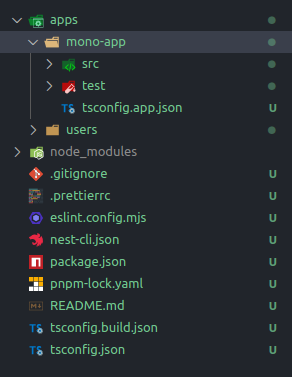
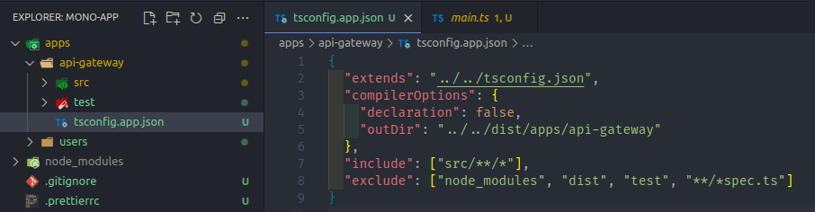
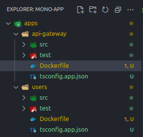
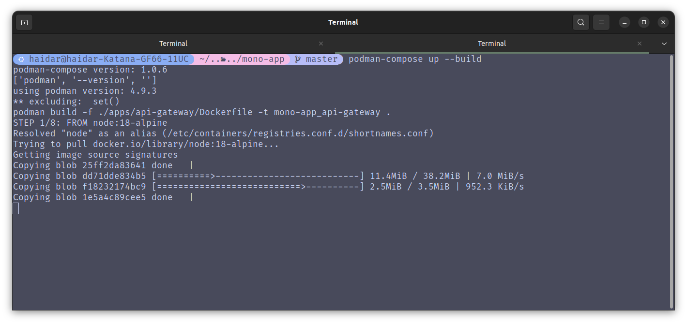
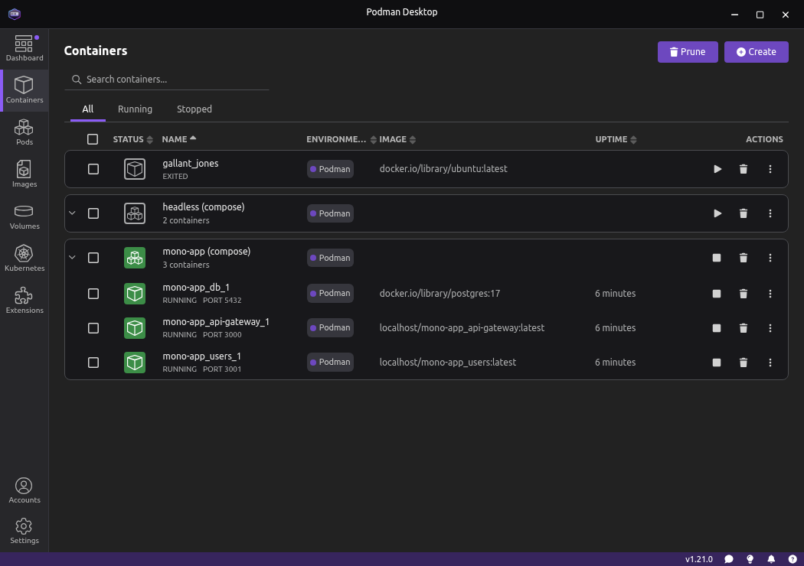
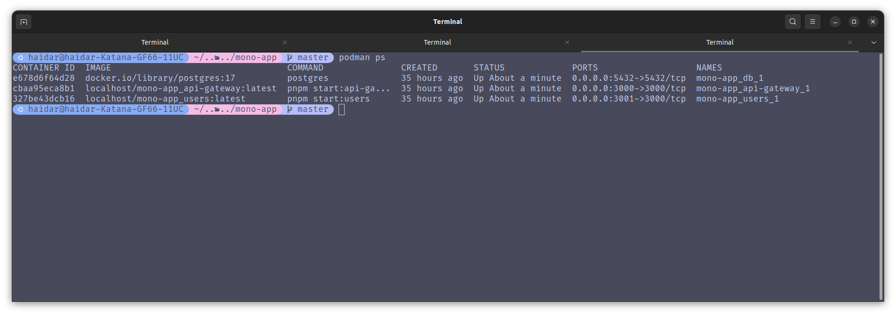

Kali ini aku akan membagikan cara sederhana untuk dockerize aplikasi NestJS yang menggunakan struktur monorepo. Dengan menggunakan Docker atau Podman, kita dapat dengan mudah mengemas aplikasi kita beserta semua dependensinya ke dalam sebuah container yang siap untuk dijalankan di berbagai lingkungan. So, mari kita mulai.

## Table of Contents

- [Table of Contents](#table-of-contents)
- [Docker](#docker)
  - [Dockerfile](#dockerfile)
  - [docker-compose.yml](#docker-composeyml)
- [Apa itu struktur Monorepo?](#apa-itu-struktur-monorepo)
  - [Struktur folder pada NestJS Monorepo](#struktur-folder-pada-nestjs-monorepo)
- [Setup Proyek NestJS Monorepo](#setup-proyek-nestjs-monorepo)
  - [Instalasi NestJS CLI secara global](#instalasi-nestjs-cli-secara-global)
  - [Membuat Proyek Baru](#membuat-proyek-baru)
  - [Setup Monorepo](#setup-monorepo)
  - [Setting nest-cli.json dan package.json](#setting-nest-clijson-dan-packagejson)
- [Setting Dockerfile untuk Monorepo NestJS](#setting-dockerfile-untuk-monorepo-nestjs)
- [Setting docker-compose.yml](#setting-docker-composeyml)
- [Jalankan Compose](#jalankan-compose)

## Docker

Docker sendiri yaitu sebuah tools untuk kita untuk mengemas aplikasi beserta semua dependensinya ke dalam sebuah container yang dapat dijalankan di berbagai lingkungan. Dengan Docker, kita dapat memastikan bahwa aplikasi kita berjalan dengan konsisten di berbagai sistem operasi dan lingkungan pengembangan.

Dalam docker kita biasanya menggunakan dua file utama yaitu `Dockerfile` dan `docker-compose.yml`.

### Dockerfile

Dockerfile berisi serangkaian instruksi yang digunakan oleh Docker untuk membangun image container, dockerfile akan menentukan base image, menyalin file, menginstal dependensi, dan mengatur perintah yang akan dijalankan saat container dijalankan.

### docker-compose.yml

File ini digunakan untuk mendefinisikan dan menjalankan multi-container Docker applications. Dengan docker-compose, kita dapat mengatur beberapa layanan, jaringan, dan volume dalam satu file konfigurasi.

## Apa itu struktur Monorepo?

Struktur monorepo adalah struktur yang di mana beberapa proyek atau package disimpan dalam satu repositori tunggal. Dalam konteks NestJS, ini memungkinkan kita untuk mengelola beberapa aplikasi atau layanan microservice dalam satu tempat, memudahkan pengelolaan dependensi dan berbagi kode antar proyek.

Monorepo sering digunakan dalam pengembangan aplikasi skala besar karena memberikan keuntungan seperti konsistensi versi, kemudahan refactoring, dan pengelolaan dependensi yang lebih sederhana.

### Struktur folder pada NestJS Monorepo

```bash
my-nestjs-monorepo/
├── apps/
│   ├── app1/
│   └── app2/
├── libs/
│   ├── common/
│   └── utils/
├── node_modules/
├── package.json
├── tsconfig.json
└── nest-cli.json
```

Struktur ini mempermudah untuk mengelola beberapa aplikasi dan library dalam satu repositori kode, memungkinkan kita untuk berbagi beberapa microservice atau library untuk microservice itu sendiri.

Tiap aplikasi di dalam folder `apps/` dapat memiliki dependensi dan konfigurasi build yang berbeda, sementara library di dalam folder `libs/` dapat digunakan bersama oleh beberapa aplikasi.

## Setup Proyek NestJS Monorepo

### Instalasi NestJS CLI secara global

```bash
npm i -g @nestjs/cli
```

### Membuat Proyek Baru

```bash
nest new nama-proyek
cd nama-proyek
```

Kamu akan mendapatkan arsitektur dasar dari proyek NestJS. Untuk mengubahnya menjadi monorepo, kita perlu menggunakan langkah berikut.

### Setup Monorepo

```bash
nest g app users
```

Step diatas akan mengubah struktur dasar NestJS menjadi monorepo dengan menambahkan folder `apps/` yang berisi aplikasi `users`.

Kita perlu mengubah juga app default menjadi api-gateway, disini by default app yang tergenerate adalah `mono-app`, karena ketika aku membuuat project baru aku menamai projectnya `mono-app`



Mengapa aku mengubah menjadi api-gateway? karena struktur monorepo bersifat microservice, jadi kita butuh gateway untuk mengatur routing ke service-service yang ada dibawahnya. Jangan lupa pada `tsconfig.json` ubah juga namanya menjadi `api-gateway`.



### Setting nest-cli.json dan package.json

`nest-cli.json`, kita perlu mengatur beberapa konfigurasi agar sesuai dengan struktur monorepo yang kita buat. Kita perlu mengatur `sourceRoot` untuk menunjuk ke folder `src` di dalam masing-masing aplikasi, serta jangan lupa rename project default menjadi `api-gateway` serta root, dan entryFilenya.

```json
{
  "$schema": "https://json.schemastore.org/nest-cli",
  "collection": "@nestjs/schematics",
  "sourceRoot": "src", <-- ubah ini menjadi src
  "compilerOptions": {
    "deleteOutDir": true,
    "webpack": true,
    "tsConfigPath": "apps/api-gateway/tsconfig.app.json"
  },
  "monorepo": true,
  "root": "apps/api-gateway",
  "projects": {
    "api-gateway": {
      "type": "application",
      "root": "apps/api-gateway",
      "entryFile": "main",
      "sourceRoot": "apps/api-gateway/src",
      "compilerOptions": {
        "tsConfigPath": "apps/api-gateway/tsconfig.app.json"
      }
    },
    "users": {
      "type": "application",
      "root": "apps/users",
      "entryFile": "main",
      "sourceRoot": "apps/users/src",
      "compilerOptions": {
        "tsConfigPath": "apps/users/tsconfig.app.json"
      }
    }
  }
}
```

Kita juga perlu menambahkan script di `package.json` untuk memudahkan kita dalam menjalankan aplikasi dari root monorepo.

```json
{
  "scripts": {
    "start:api-gateway": "nest start api-gateway",
    "start:users": "nest start users",
    "build:api-gateway": "nest build api-gateway",
    "build:users": "nest build users"
  }
}
```

## Setting Dockerfile untuk Monorepo NestJS

Kita tambahkan dan atur Dockerfile di tiap aplikasi yang ada di dalam folder `apps/`. Ini contoh Dockerfile yang kita gunakan untuk aplikasi `api-gateway`.




```yaml
FROM node:18-alpine

# Install pnpm global
RUN npm install -g pnpm

WORKDIR /app

COPY package*.json ./
RUN pnpm install

COPY . .

RUN pnpm build:api-gateway <-- sesuaikan dengan nama aplikasimu

CMD ["pnpm", "start:api-gateway"] <-- sesuaikan dengan nama aplikasimu
```

Kalian tinggal menyesuaikan dockerfile ini di tiap aplikasi yang ada di folder `apps/` sesuai dengan nama aplikasinya.

## Setting docker-compose.yml

Kita buat file `docker-compose.yml` di root folder monorepo kita. Berikut contoh konfigurasi untuk menjalankan container aplikasi `api-gateway` dan `users`.

Kita set port untuk `api-gateway` di `3000` dan `users` di `3001`, serta menambahkan service database PostgreSQL, dengan presistece volume untuk menyimpan data database secara permanen.

```yaml
services:
  api-gateway:
    build:
      context: .
      dockerfile: apps/api-gateway/Dockerfile
    ports:
      - "3000:3000"
    volumes:
      - .:/app
      - /app/node_modules
    command: pnpm start:api-gateway
    depends_on:
      - db

  users:
    build:
      context: .
      dockerfile: apps/users/Dockerfile
    ports:
      - "3001:3000"
    volumes:
      - .:/app
      - /app/node_modules
    command: pnpm start:users
    depends_on:
      - db

  db:
    image: postgres:17
    ports:
      - "5432:5432"
    environment:
      POSTGRES_USER: postgres
      POSTGRES_PASSWORD: postgres
      POSTGRES_DB: postgres
    volumes:
      - postgres_data:/var/lib/postgresql/data

volumes:
  postgres_data:
```

## Jalankan Compose

Setelah semua konfigurasi selesai, kita bisa menjalankan docker-compose untuk membangun dan menjalankan container aplikasi kita.

```bash
docker-compose up --build
```

atau jika kamu menggunakan podman bisa menggunakan podman-compose

```bash
podman-compose up --build
```



Jika telah dijalankan maka kamu dapat melihat container tersebut berjalan pada docker kalian, jika kalian menggunakan docker desktop kalian dapat melihat pada tab container, begitu juga jika kalian menggunakan podman desktop kalian dapat melihat pada tab container juga. Disini aku menggunakan podman desktop



Atau jika kalian menggunakan docker CLI atau podman CLI kalian dapat melihat dengan perintah ini

```bash
docker ps
```

Untuk podman

```bash
podman ps
```



Sebagai catatan kedepannya, kalian bisa menambahkan database, dan service-service lain sesuai kebutuhan kalian pada file `docker-compose.yml`, seperti Redis, RabbitMQ, atau service lainnya yang diperlukan oleh aplikasi kalian.